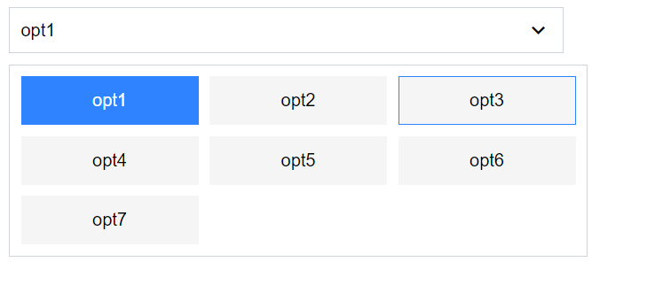

# WeSelect

This library was generated with [Angular CLI](https://github.com/angular/angular-cli) version 14.2.0.
## we-multi-col-select


### Usage
- Add `WeSelectModule` to the imports array in your module and you can start using the `we-multi-col-select`.

```
<we-multi-col-select 
    [options]="options"
    [containerWidth]="optionsContainerWidth"
    [columns]="numberOfColumns"
    [disabled]="isDisabled"
    [selectedOption]="selectedOption"
    (onSelectChange)="onOptionSelect($event)"
>
</we-multi-col-select>
```

### Inputs

options.ts
```
export interface Option{
    value: any;
    displayText: string;
}
```

optionsContainerWidth - The width of the optionsContainer in pixels. The default width is `500px`.

columns - number of options to be displayed in each row. The entire width of the optionsContainer is equally distributed among the columns. The default value is set to `1`.

disabled - disabled takes a boolean value. The default value is set to `false`.

selectedOption - It allows you to pass a `Option` which should be selected by default.

### Outputs

onSelectChange - onSelectChange output event is emitted when ever the selected option changes. It emits the value property from the selectedOption.


## Code scaffolding

Run `ng generate component component-name --project we` to generate a new component. You can also use `ng generate directive|pipe|service|class|guard|interface|enum|module --project we`.
> Note: Don't forget to add `--project we-select` or else it will be added to the default project in your `angular.json` file. 

## Build

Run `ng build we-select` to build the project. The build artifacts will be stored in the `dist/` directory.

## Publishing

After building your library with `ng build we-select`, go to the dist folder `cd dist/we-select` and run `npm publish`.

